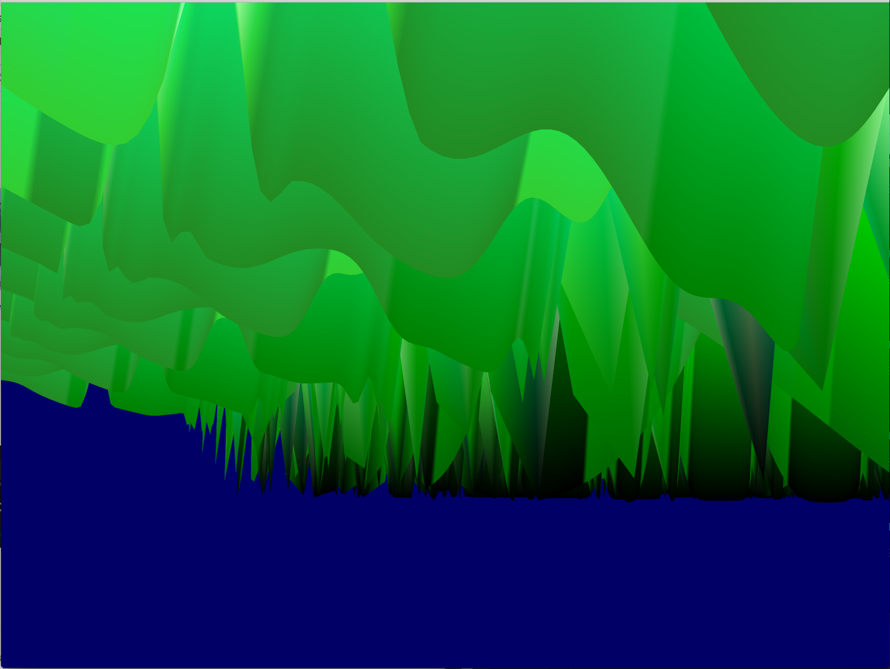

# Modeling Chaos in OpenGL

### Motivation
#### Logistic Map
```
x_t+1 = r * x_t * (1 - x_t)
```

This is the equation of the logistic map. x_t+1 represents the population at t + 1. It's value is found by multiplying the growth rate r with the current population and 1 minus the current population.

Let's simplify the problem to a pack of wolves. The current population of wolves will grow in population by a certain growth rate. The more wolves there are the faster the growth rate. The wolf population will grow until there are two many wolves and not enough space/food etc for them all to survive and some of them will die out. The higher the wolf population the smaller 1 - x_t will be.

#### Bifurcation Diagram


At growth rate 2.8 the population settles to a single value. At 3.2 the population alternate between two different values. At 3.5 there is another split and function alternate between 4 values. This divison happnes until chaos occurs. The grey spaces where no pattern is found. Until the system settles again. This can be seen in the white spaces between blocks of chaos. The system seem to alternate between fixed number of values until chaos hits again.

### Modelling this Diagram in 3D

I think it would be cool to model this diagram in three dimenstions; x value being time, y being the population and z being the growth rate.





### Running the Code

```
>> g++ -std=c++11 common/shader.cpp common/controls.cpp test.cpp -framework OpenGL -framework Cocoa -framework IOKit -framework CoreVideo -lglfw3 -lglew

>> ./a.out
```